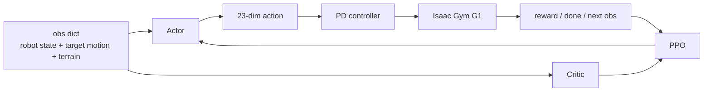
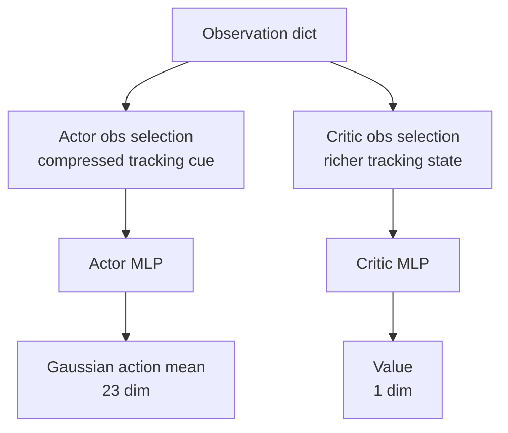
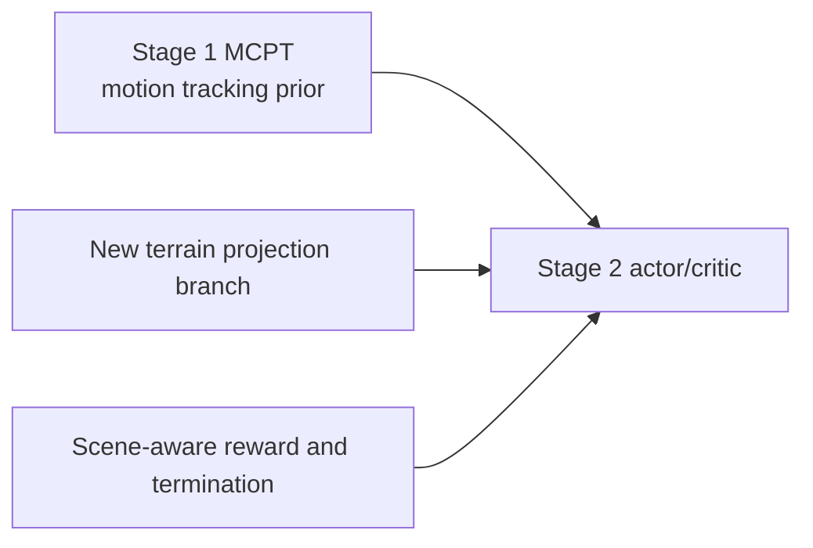

# VideoMimic Simulation 학습 구조: 네트워크, Actor-Critic, PPO, 보상

작성일: 2026-04-10
범위: `real2sim` 결과를 Isaac Gym에서 학습할 때 사용되는 policy network, actor-critic 구조, PPO 학습 루프, reward/termination 설계를 설명한다. 데이터 로딩, FPS, scene/motion 샘플링은 별도 문서 `videomimic_simulation_data_and_sampling_ko.md`에서 다룬다.

## 1. 이 문서의 핵심

VideoMimic의 simulation 학습은 크게 보면 “reference motion을 따라가면서 scene 위에서 넘어지지 않는 G1 policy”를 PPO로 학습하는 과정이다.



Stage 2의 대표 task는 `g1_deepmimic_proj_heightfield`다. 이 task는 Stage 1 MoCap pretraining checkpoint에서 출발해, real2sim으로 만든 scene/motion data 위에서 scene-aware motion tracking을 finetune한다.

## 2. 학습 stage 관점에서 policy가 하는 일

VideoMimic simulation의 큰 학습 흐름은 네 단계다.

| Stage | 역할 | policy 관점 |
| --- | --- | --- |
| Stage 1 | MoCap pretraining / MCPT | scene 없이 reference motion tracking prior를 학습 |
| Stage 2 | scene-aware tracking RL | Stage 1 policy를 시작점으로 scene/terrain 위에서 reference tracking을 finetune |
| Stage 3 | distillation / DAgger | reference-aware teacher를 더 단순한 deployable student로 distill |
| Stage 4 | RL finetuning | distill된 student를 RL reward로 더 다듬음 |

이 문서에서 주로 설명하는 구조는 Stage 2 `g1_deepmimic_proj_heightfield`다.

Stage 2의 중요한 특징:

- Actor는 현재 robot state, reference target cue, local height map을 보고 행동한다.
- Critic은 actor보다 더 많은 privileged tracking 정보를 보고 value를 예측한다.
- Actor 출력은 torque가 아니라 23개 joint position target offset이다.
- Reward는 joint/link/torso tracking, contact matching, regularization, alive/termination 항의 합이다.
- PPO가 rollout을 모아 actor와 critic을 동시에 업데이트한다.

## 3. Actor-Critic 구조 개요

VideoMimic Stage 2 policy는 asymmetric actor-critic이다. Actor와 critic은 같은 observation dictionary를 받지만, 내부에서 사용하는 observation key가 다르다.



왜 asymmetric인가?

- Actor는 실제 policy로 쓰이는 네트워크다. 너무 많은 privileged 정보를 주면 학습에는 편하지만, 배포/일반화 관점에서는 바람직하지 않을 수 있다.
- Critic은 학습 중 value estimation을 위한 네트워크다. 더 많은 정보를 줘서 “현재 상태가 얼마나 좋은지”를 잘 평가하게 만들 수 있다.

즉 actor는 “무엇을 할지”를 결정하고, critic은 “지금 상태가 좋은지”를 평가한다.

## 4. Actor 입력

공식 Stage 2 script가 사용하는 `g1_deepmimic_proj_heightfield` 기준 actor의 raw input은 `415`차원이다. 이 공식 Stage 2 variant에서는 terrain height map이 이 415차원에 concat되지 않고, 별도 projection branch로 첫 hidden layer에 더해진다.

| 입력 key | 차원 | 의미 |
| --- | ---: | --- |
| `history_torso_real` | `75 x 5 = 375` | 최근 5 step의 proprioception |
| `history_torso_xy_rel` | `2 x 5 = 10` | target torso 대비 현재 torso의 xy 상대 오차 |
| `history_torso_yaw_rel` | `1 x 5 = 5` | target torso 대비 yaw/heading 오차 |
| `target_joints` | `23` | 현재 따라야 할 reference joint pose |
| `target_root_roll` | `1` | reference root roll |
| `target_root_pitch` | `1` | reference root pitch |
| 합계 | `415` | terrain 제외 actor raw input |

`torso_real` 75차원은 다음으로 구성된다.

```text
base angular velocity        3
projected gravity            3
joint position offset       23
joint velocity              23
previous/current action     23
--------------------------------
total                       75
```

Actor가 받는 tracking cue가 “압축되어 있다”는 말은, actor가 모든 link별 target-current error를 직접 받는 것이 아니라:

- torso의 상대 xy/yaw 오차
- target joint pose
- target root roll/pitch
- 최근 proprioception history

같은 요약된 신호로 행동을 결정한다는 뜻이다.

## 5. Critic 입력

Critic은 actor가 보는 415차원에 `torso`와 `deepmimic`을 추가로 본다. 따라서 raw input은 `623`차원이다.

| 입력 블록 | 차원 | 의미 |
| --- | ---: | --- |
| actor가 보는 입력 | `415` | compressed tracking/proprioception cue |
| `torso` | `79` | 현재 robot state를 더 직접적으로 담은 proprioception |
| `deepmimic` | `129` | reference 대비 tracking error에 가까운 privileged 정보 |
| 합계 | `623` | critic raw input |

`torso` 79차원은 다음으로 구성된다.

```text
root height                  1
base linear velocity         3
base angular velocity        3
projected gravity            3
joint position offset       23
joint velocity              23
action                      23
--------------------------------
total                       79
```

`deepmimic`은 critic이 현재 상태를 reference와 비교하기 쉽게 만든 tracking 정보다. 대략 다음 요소가 포함된다.

| 구성 | 의미 |
| --- | --- |
| tracked link heights | 각 tracked link의 scene 기준 높이 |
| target root quaternion | reference root orientation |
| target root position relative to current | 현재 root 기준 target root 위치 |
| target joints minus current joints | joint tracking error |
| target tracked link positions minus current | link tracking error |
| current tracked link velocities | 현재 link velocity |
| contact state / target contacts / invalid changes | 실제 접촉과 reference 접촉의 관계 |

이 때문에 critic은 actor보다 tracking 품질을 더 직접적으로 평가할 수 있다.

## 6. Height map branch와 attention gate

Scene-aware Stage 2 policy는 torso 주변 local height map을 본다.

| 항목 | 값 |
| --- | --- |
| sensor name | `terrain_height` |
| 기준 link | `torso_link` |
| coverage | `1.0 m x 1.0 m` |
| resolution | `0.1 m` |
| grid | `11 x 11` |
| flatten 후 | `121`차원 |

중요한 점은 공식 Stage 2 task인 `g1_deepmimic_proj_heightfield`에서는 height map이 actor/critic raw input에 concat되지 않는다는 것이다. 대신 첫 hidden layer의 512차원 공간에 projection되어 더해진다.

```text
terrain_height: [11, 11]
-> flatten: [121]
-> Linear(121 -> 512): z(x)
-> z(x) * attention[512]
-> first hidden layer output에 add
```

전체 구조는 다음과 같다.

```text
actor:
  raw obs R^415
  Linear(415 -> 512)
  + terrain_proj(121 -> 512) * actor_attention(512)
  -> ELU
  -> Linear(512 -> 256) -> ELU
  -> Linear(256 -> 128) -> ELU
  -> Linear(128 -> 23)

critic:
  raw obs R^623
  Linear(623 -> 512)
  + terrain_proj(121 -> 512) * critic_attention(512)
  -> ELU
  -> Linear(512 -> 256) -> ELU
  -> Linear(256 -> 128) -> ELU
  -> Linear(128 -> 1)
```

여기서 `attention`은 Transformer attention이 아니다.

- 512차원의 learnable parameter vector다.
- 한 forward pass에서 height map 값에 따라 바뀌지 않는다.
- PPO 학습 중 gradient update를 통해 변한다.
- actor와 critic은 서로 다른 terrain attention vector를 가진다.

실제 terrain residual은 다음이다.

```text
z(x) = Linear(flatten(height_map))
terrain_residual(x) = z(x) * attention
hidden_0 = Linear(other_obs) + terrain_residual(x)
```

따라서 `attention` 값만으로 terrain 사용량을 완전히 알 수는 없다. 실제 영향은 `terrain_residual(x)`의 크기와, `Linear(other_obs)` 대비 상대적 크기까지 봐야 한다.

주의할 점은 같은 config 파일 안에 다른 variant도 함께 남아 있다는 것이다. 예를 들어 `G1DeepmimicHeightFieldPolicyCfg`는 `terrain_height = {'type': 'flatten_then_embed_with_attention', 'output_dim': ...}`를 사용한다. 이 경우 terrain branch 출력은 `ForwardProcDict`의 일반 head로 들어가며, `add_outputs=False`일 때 다른 observation head들과 `torch.cat(..., dim=-1)`로 합쳐진다. 즉:

- 공식 Stage 2 script의 `g1_deepmimic_proj_heightfield`는 `to_hidden` variant이므로 `add`
- 같은 파일의 예전/대안 `heightfield` variant는 일반 head이므로 `concat`

사수가 말한 `concat`은 이 대안 variant를 가리키면 맞고, 우리가 문서에서 설명한 공식 Stage 2는 `add`가 맞다.

## 7. Actor 출력과 low-level control

Actor는 23차원 Gaussian distribution의 mean을 출력한다.

```text
actor output: μ(s) in R^23
std:          learnable state-independent vector in R^23
training:     action ~ Normal(μ, std)
inference:    action = μ
```

이 23차원 action은 torque가 아니다. Stage 2의 control type은 `P`이고, action은 PD position target offset으로 해석된다.

```text
target_dof_pos = default_dof_pos + action_scale * action
action_scale = 0.25
```

따라서 action `1.0`은 대략 `0.25 rad`의 joint target offset이다. 이후 PD controller가 torque를 계산해 Isaac Gym에 넣는다.

## 8. PPO 학습 루프

학습 루프는 `OnPolicyRunner`와 `PPO`가 담당한다.

```mermaid
flowchart TD
    A[현재 obs] --> B[Actor가 action sampling]
    B --> C[env.step(action)]
    C --> D[reward, done, next obs]
    D --> E[RolloutStorage에 transition 저장]
    E --> F[num_steps_per_env만큼 반복]
    F --> G[critic으로 bootstrap value 계산]
    G --> H[GAE return / advantage 계산]
    H --> I[PPO clipped objective로 update]
    I --> A
```

기본 PPO 설정은 다음과 같다.

| 항목 | 값 |
| --- | --- |
| `num_steps_per_env` | `24` |
| `num_learning_epochs` | `5` |
| `num_mini_batches` | `4` |
| `clip_param` | `0.2` |
| `gamma` | `0.99` |
| `lam` | `0.95` |
| `entropy_coef` | `0.0025` |
| `desired_kl` | `0.02` |
| `max_grad_norm` | `1.0` |
| Stage 2 learning rate | `2e-5` script override |
| Stage 2 schedule | `fixed` |

한 PPO iteration은 “simulator 한 step”이 아니다. 예를 들어 Stage 2 공식 설정처럼 `num_envs=4096`, `num_steps_per_env=24`라면:

```text
one iteration = 4096 x 24 = 98,304 env-steps 수집 + PPO update
```

## 9. PPO objective 구성

PPO update는 크게 네 항을 합친다.

```text
loss =
  surrogate PPO policy loss
  + value_loss_coef * value loss
  - entropy_coef * entropy
  + optional BC loss
  + optional bounds loss
```

Stage 2 tracking RL에서는 일반적으로 `bc_loss_coef=0`이므로 PPO policy/value loss가 중심이다. Stage 3 distillation에서는 `bc_loss_coef=1.0`을 사용해 teacher action을 따라 하는 방향으로 학습한다.

주요 항:

| 항 | 의미 |
| --- | --- |
| surrogate loss | PPO clipped policy gradient |
| value loss | critic value와 return의 MSE, clipped value loss 사용 |
| entropy | action distribution exploration 유지 |
| BC loss | teacher policy를 따라 하는 distillation/DAgger용 |
| bounds loss | action mean이 너무 큰 범위를 벗어나지 않도록 하는 보조 항 |

## 10. Reward 설계 개요

Reward는 여러 항의 weighted sum이다. config에서 scale이 0이 아닌 항만 실제 reward에 들어간다.

```text
reward =
  Σ scale_i * reward_i
  + termination reward
```

코드상 reward 함수는 `self._reward_<name>()` 형태로 구현되어 있고, config의 `rewards.scales.<name>`가 0이 아니면 호출된다.

## 11. 주요 tracking reward

| Reward | 의미 | 형태 |
| --- | --- | --- |
| `joint_pos_tracking` | reference joint pose 추적 | `exp(-||q - q_ref||^2 * k)` |
| `joint_vel_tracking` | reference joint velocity 추적 | `exp(-||dq - dq_ref||^2 * k)` |
| `link_pos_tracking` | 13개 tracked link 위치 추적 | `exp(-Σ_link ||p - p_ref||^2 * k)` |
| `link_vel_tracking` | tracked link velocity 추적 | `exp(-Σ_link ||v - v_ref||^2 * k)` |
| `torso_pos_tracking` | torso 위치 추적 | `exp(-||p_torso - p_ref||^2 * k)` |
| `torso_orientation_tracking` | torso orientation 추적 | orientation error 기반 exponential reward |
| `root_orientation_tracking` | root orientation 추적 | orientation error 기반 exponential reward |

기본 scale 중 중요한 값:

| Reward scale | 기본값 |
| --- | ---: |
| `joint_pos_tracking` | `120.0` |
| `link_pos_tracking` | `30.0` |
| `joint_vel_tracking` | `24.0` |
| `link_vel_tracking` | `5.0` |
| `torso_pos_tracking` | `15.0` |
| `torso_orientation_tracking` | `15.0` |
| `root_orientation_tracking` | `15.0` |

해석:

- `joint_pos_tracking`은 관절 각도 자체를 reference와 맞추게 한다.
- `link_pos_tracking`은 손, 발, 무릎, 팔꿈치, pelvis 등 body point의 Cartesian 위치를 맞추게 한다.
- `torso/root` reward는 몸통 자세와 방향을 안정화한다.

## 12. Contact와 regularization reward

`retarget_poses_g1.h5`에는 `contacts/left_foot`, `contacts/right_foot`가 들어 있다. 학습 중 실제 foot contact와 target contact를 비교해 reward/penalty를 준다.

| Reward | 의미 |
| --- | --- |
| `feet_contact_matching` | 실제 발 접촉 여부가 reference contact와 맞으면 보상 |
| `contact_smoothness` | target contact 변화와 맞지 않는 갑작스러운 접촉 변화 penalty |
| `no_fly` | 양발이 공중이면 penalty, 단 target이 그런 상태면 예외 |
| `feet_swing_height` | swing/stance 상태에 따른 발 높이 조절 |
| `ankle_action` | ankle action 크기 penalty |
| `action_rate` | action 변화량 penalty |
| `collision` | 지정 body collision penalty |
| `dof_pos_limits` | joint limit 접근 penalty |

Stage 2 script는 보통 다음 scale을 override한다.

```bash
--env.rewards.scales.termination=-2000
--env.rewards.scales.alive=200.0
--env.rewards.scales.ankle_action=-3.0
--env.rewards.scales.action_rate=-3.0
```

즉 Stage 2에서는:

- 살아남는 것을 강하게 보상하고,
- 실패 termination을 크게 벌점화하며,
- ankle/action 변화가 너무 커지는 것을 억제한다.

## 13. Termination과 success

DeepMimic 계열의 가장 중요한 termination은 tracked link 위치 오차다.

```text
link_pos_error = ||current_tracked_link_pos - target_tracked_link_pos||

if any tracked link error > link_pos_error_threshold:
    reset
```

Stage 2 script에서는 보통:

```bash
--env.deepmimic.link_pos_error_threshold=0.5
```

를 사용한다. 즉 13개 tracked link 중 하나라도 reference 위치에서 0.5 m 이상 벗어나면 실패 reset된다. 단, episode 시작 직후 2 step은 예외다.

Success는 reward가 높다는 뜻이 아니다.

```text
success = time_out_buf == True
```

즉 실패 termination 없이 episode 최대 길이까지 도달하면 success다. 따라서 success rate는 중요한 지표지만 motion tracking quality 전체를 대변하지는 않는다. 특히 random start offset을 쓰면 “clip 전체를 처음부터 끝까지 성공”이 아니라 “샘플된 시작점부터 남은 구간을 끝까지 버팀”이 된다.

## 14. Pretraining이 네트워크에 주는 의미

Stage 1 pretrained checkpoint는 scene/terrain을 미리 본 모델이 아니다. MoCap reference tracking을 통해 G1의 whole-body motion prior를 학습한 모델이다.

Stage 2에서는:

- 기존 actor/critic weight 중 구조가 맞는 부분은 이어받는다.
- `g1_deepmimic_proj_heightfield`에서 새로 생기는 terrain branch는 새로 학습된다.
- `load_model_strict=False`를 사용해 구조가 달라도 가능한 부분만 load한다.



따라서 pretraining의 효과는 보통:

- 초기 policy가 reference motion 근처에서 움직일 수 있음
- reset 직후 큰 자세 붕괴를 줄임
- sparse/hard terrain reward를 받기 전에 기본 tracking reward를 얻기 쉬움

으로 나타난다.

## 15. 코드 위치 지도

| 기능 | 주요 파일 |
| --- | --- |
| Stage 2 config / obs / reward scale | `simulation/videomimic_gym/legged_gym/envs/g1/g1_deepmimic_config.py` |
| Actor-Critic network | `simulation/videomimic_rl/rsl_rl/modules/actor_critic.py` |
| PPO runner | `simulation/videomimic_rl/rsl_rl/runners/on_policy_runner.py` |
| PPO loss/update | `simulation/videomimic_rl/rsl_rl/algorithms/ppo.py` |
| Reward/termination 구현 | `simulation/videomimic_gym/legged_gym/envs/base/robot_deepmimic.py` |
| Low-level PD control | `simulation/videomimic_gym/legged_gym/envs/base/legged_robot.py` |

## 16. 학습 파트를 볼 때 기억할 것

1. Actor input은 `415`차원, critic input은 `623`차원이다.
2. Height map은 raw input에 concat되지 않고 `121 -> 512` projection 후 첫 hidden layer에 더해진다.
3. Actor 출력 23차원은 torque가 아니라 PD joint target offset이다.
4. Critic은 actor보다 더 많은 privileged tracking 정보를 본다.
5. Reward는 tracking, contact, regularization, alive/termination 항의 합이다.
6. Success는 “timeout까지 살아남음”이지 “tracking error가 작음”과 동일하지 않다.
7. Pretraining은 terrain 지식이 아니라 G1 motion tracking prior를 제공한다.
