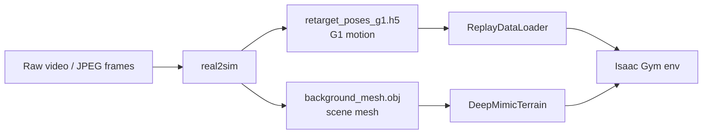
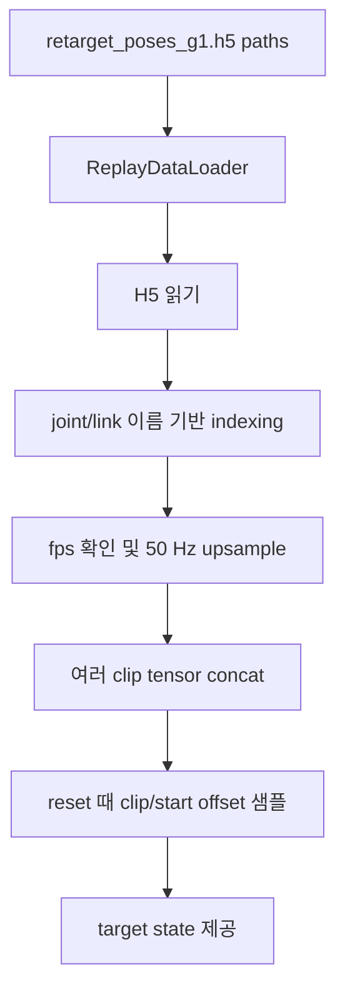

# VideoMimic Simulation 데이터와 샘플링 구조: scene, motion, FPS, simulator setup

작성일: 2026-04-10
범위: `real2sim` 이후 생성된 motion/scene 데이터가 simulation에서 어떻게 로드되고, Isaac Gym 환경이 어떻게 구성되며, FPS/upsampling/start offset/success 같은 실전 이슈가 어떻게 처리되는지 설명한다. 네트워크, PPO, reward 설계는 별도 문서 `videomimic_learning_network_reward_ko.md`에서 다룬다.

## 1. 이 문서의 핵심

VideoMimic의 simulation 학습은 raw video를 직접 읽지 않는다. raw video는 real2sim이 처리하고, simulation은 그 결과물인 `retarget_poses_g1.h5`와 `background_mesh.obj`를 읽는다.



Simulation에서 중요한 질문은 네 가지다.

- 어떤 motion file을 읽는가?
- 어떤 scene mesh를 읽는가?
- 여러 clip을 어떻게 한 simulator 안에 배치하는가?
- episode 시작 frame과 FPS를 어떻게 맞추는가?

## 2. real2sim 결과물

`real2sim`은 단일 RGB 비디오에서 사람 motion과 scene geometry를 복원하고, 사람 motion을 G1 robot motion으로 retarget한다.

Simulation이 사용하는 clip folder는 보통 다음 구조다.

```text
simulation/data/videomimic_captures/<clip_name>/
├── retarget_poses_g1.h5
└── background_mesh.obj
```

| 파일 | 의미 | simulation에서 쓰이는 곳 |
| --- | --- | --- |
| `retarget_poses_g1.h5` | G1 reference motion | reset state, target pose, target velocity, target contact |
| `background_mesh.obj` | gravity-aligned scene mesh | Isaac Gym terrain mesh |

중요한 구분:

- `simulation/data/videomimic_raw_videos_mp4`의 mp4는 사람이 보기 위한 raw video 변환본이다.
- 학습은 이 mp4를 직접 읽지 않는다.
- 학습은 `videomimic_captures`의 `h5 + obj`를 읽는다.

## 3. H5 motion 파일 내부

`retarget_poses_g1.h5`는 robot이 따라가야 할 reference trajectory다.

| H5 key / attr | 의미 |
| --- | --- |
| `root_pos` | reference root position |
| `root_quat` | reference root orientation |
| `joints` | reference G1 joint positions |
| `link_pos` | reference link positions |
| `link_quat` | reference link orientations |
| `contacts/left_foot` | left foot target contact |
| `contacts/right_foot` | right foot target contact |
| attr `joint_names` | joint order |
| attr `link_names` | link order |
| attr `fps` | source motion fps |

Simulation은 이 파일에서 필요한 joint/link만 현재 G1 asset 순서에 맞게 뽑는다. 따라서 H5 안의 배열 순서와 simulator의 DOF 순서가 다르더라도, 이름 기반 indexing으로 맞춘다.

## 4. 123개 VideoMimic clip 목록

공식 123개 scene-aware training clip은 다음 YAML이 지정한다.

```text
simulation/videomimic_gym/resources/data_config/human_motion_list_123_motions.yaml
```

각 항목은 대략 다음 형태다.

```yaml
- folder_path: "new_stairs_apr19/megahunter_megasam_reconstruction_results_IMG_8044_cam01_frame_0_350_subsample_1"
  teacher_checkpoint_run_name: "20250428_185201_g1_deepmimic"
  human_video_data_pattern: "retarget_poses_g1.h5"
  human_video_terrain_pattern: "background_mesh.obj"
  default_data_fps_override: 60
```

Simulation loader는 `folder_path` 전체 경로를 그대로 쓰기보다, 마지막 folder name이 `simulation/data/videomimic_captures` 안의 실제 folder name에 포함되는지 partial match로 찾는다.

즉 YAML entry에서 최종적으로 만들어지는 것은 다음 두 path다.

```text
<matched_capture_folder>/retarget_poses_g1.h5
<matched_capture_folder>/background_mesh.obj
```

## 5. Motion loader: ReplayDataLoader

Motion은 `ReplayDataLoader`가 담당한다.



주요 역할:

- `.h5` 또는 `.pkl` motion file을 읽는다.
- `root_pos`, `root_quat`, `joints`, `link_pos`, `link_quat`, `contacts`를 tensor로 변환한다.
- G1의 현재 DOF/link 이름 순서에 맞춰 데이터를 재정렬한다.
- source fps와 simulator policy fps가 다르면 upsample한다.
- 여러 clip을 하나의 큰 tensor로 이어 붙이고, 각 clip의 start/end index를 기록한다.
- 각 env가 reset될 때 어떤 clip의 몇 번째 frame부터 시작할지 샘플한다.

## 6. Scene loader: DeepMimicTerrain

Scene은 `DeepMimicTerrain`이 담당한다. 각 clip의 `background_mesh.obj`를 읽어 Isaac Gym에 넣을 terrain mesh를 만든다.

여러 clip을 학습할 때는 scene mesh들을 하나의 큰 grid mesh로 이어 붙인다.

```text
global terrain mesh
├── row 0: clip0 mesh | clip1 mesh | clip2 mesh | ...
├── row 1: clip0 mesh | clip1 mesh | clip2 mesh | ...
└── ...
```

각 clip은 grid 안에서 자기 위치를 갖고, env는 해당 위치로 offset된다. 이 offset이 `env_offsets`다.

```text
world_position = clip_local_position + env_offset
clip_local_position = world_position - env_offset
```

이 구조가 필요한 이유:

- Isaac Gym에서 많은 env를 병렬로 돌리기 위해 terrain mesh를 batch-friendly하게 구성한다.
- 서로 다른 scene을 하나의 global mesh에 배치하고, robot과 reference motion을 offset으로 맞춘다.
- 같은 clip에 너무 많은 robot이 겹치면 느려질 수 있으므로 `terrain.n_rows`로 row 수를 늘려 겹침을 줄일 수 있다.

## 7. Isaac Gym simulator setup

Stage 2 `g1_deepmimic_proj_heightfield` 기준 주요 simulator 설정은 다음과 같다.

| 항목 | 값 |
| --- | --- |
| simulator | Isaac Gym / PhysX |
| robot | Unitree G1 |
| robot asset | `g1_29dof_anneal_23dof.urdf` |
| active DOF/action | 23 |
| terrain | `background_mesh.obj` trimesh |
| physics dt | `1/200 s = 0.005 s` |
| decimation | `4` |
| policy/env dt | `0.02 s` |
| policy/env frequency | `50 Hz` |
| default Stage 2 env count | `4096` |
| control type | `P`, position target PD |
| action scale | `0.25` |

한 policy step은 physics step 4개로 구성된다.

```text
policy step 1 at 50 Hz
 ├─ physics step 1 at 200 Hz
 ├─ physics step 2 at 200 Hz
 ├─ physics step 3 at 200 Hz
 └─ physics step 4 at 200 Hz
```

## 8. FPS와 upsampling 이슈

VideoMimic에서 FPS는 세 종류가 섞인다.

| 구분 | 예시 | 의미 |
| --- | --- | --- |
| raw video fps | 30, 60 등 | 원본 영상 또는 JPEG sequence의 시간축 |
| H5 motion fps | H5 attr `fps` | real2sim/retarget 결과 motion의 fps |
| policy fps | 50 Hz | Isaac Gym env step frequency |

학습은 policy가 50 Hz로 움직이기 때문에, reference motion도 50 Hz로 맞춰야 한다. 그래서 `upsample_data=True`일 때 `ReplayDataLoader`가 source fps를 target fps인 `1 / env.dt = 50 Hz`로 변환한다.

Upsampling 방식:

| 데이터 | 보간 방식 |
| --- | --- |
| `root_pos` | linear interpolation |
| `joints` | linear interpolation |
| `root_quat` | SLERP |
| `link_pos` | linear interpolation |
| `link_quat` | SLERP |
| `contacts` | nearest-neighbor |

주의할 점:

- YAML의 `default_data_fps_override`가 있어도, H5에 `fps` attr가 있으면 H5의 fps가 우선될 수 있다.
- eval mp4를 50 fps로 저장하는 것은 “원본 영상 fps”가 아니라 “policy rollout 50 Hz”에 맞춘 것이다.
- 따라서 raw video가 60 fps여도, simulator 학습/eval rollout은 보통 50 Hz로 해석된다.

## 9. Reset 시 motion sampling

각 env가 reset될 때 `ReplayDataLoader.reset()`이 새 episode를 샘플한다.

샘플링에는 두 층이 있다.

### 9.1 어떤 clip을 고를 것인가

여러 clip이 있을 때 clip 선택 방식은 `clip_weighting_strategy`가 제어한다.

| 전략 | 의미 |
| --- | --- |
| `uniform_step` | 전체 clip의 모든 step을 동일 확률로 본다. 긴 clip이 더 자주 뽑힌다. |
| `uniform_clip` | clip별 총 확률을 동일하게 둔다. |
| `success_rate_adaptive` | success rate가 낮은 clip에 더 높은 weight를 줄 수 있다. |

현재 config 기본값은 `success_rate_adaptive` 쪽이다. `G1DeepMimic`은 각 clip의 최근 success history를 기록하고, 일정 주기로 replay loader의 adaptive weight를 업데이트할 수 있다.

### 9.2 clip 내부의 몇 번째 frame에서 시작할 것인가

`randomize_start_offset=True`이면 episode는 clip의 첫 frame에서만 시작하지 않는다. clip 내부의 가능한 start offset 중 하나를 샘플한다.

```text
offset = 0       -> clip 첫 policy step에서 시작
offset = 50      -> 50 Hz 기준 약 1초 뒤에서 시작
offset = 250     -> 50 Hz 기준 약 5초 뒤에서 시작
```

`weighting_strategy`는 clip 내부 start offset의 분포를 제어한다.

| 전략 | 의미 |
| --- | --- |
| `uniform` | 가능한 start offset을 균등하게 샘플 |
| `linear` | 앞쪽 frame에 더 큰 weight를 줄 수 있음 |

이 때문에 eval success rate를 해석할 때 start offset이 매우 중요하다. 중간 또는 후반에서 시작하면 남은 motion이 짧아 성공하기 쉬울 수 있다.

## 10. Episode length와 truncate_rollout_length

각 episode의 최대 길이는 기본적으로 reference clip의 남은 길이다. 다만 `truncate_rollout_length`가 양수이면 더 짧게 제한할 수 있다.

Stage 2 script는 보통:

```bash
--env.deepmimic.truncate_rollout_length=500
```

를 사용한다.

의미:

- policy step 기준 최대 500 step
- 50 Hz 기준 `500 / 50 = 10 seconds`
- clip이 더 짧으면 clip 길이가 실제 maximum이 된다.
- clip이 더 길면 10초 단위로 잘려 학습될 수 있다.

## 11. Success와 mean_episode_length 해석

Success는 “reward가 좋다”가 아니라 “timeout까지 살아남았다”는 뜻이다.

```text
success = time_out_buf == True
```

Failure는 보통 다음 이유로 생긴다.

- tracked link 중 하나가 reference 위치에서 threshold 이상 벗어남
- 지정 body contact force가 너무 큼
- large foot contact force termination이 켜진 경우 발 충격이 너무 큼
- episode 중 넘어지거나 collision 기준을 넘김

`Train/mean_episode_length`는 policy step 개수다. Stage 2는 50 Hz이므로:

```text
mean_episode_length = 100  ->  2.0 seconds
mean_episode_length = 250  ->  5.0 seconds
mean_episode_length = 500  -> 10.0 seconds
```

중요한 해석:

- random start eval에서 success가 높아도, 첫 frame부터 전체 clip을 성공한다는 뜻은 아니다.
- start offset이 뒤쪽이면 남은 길이가 짧아 success가 쉽게 올라갈 수 있다.
- motion tracking quality를 보려면 success뿐 아니라 link/joint/root error를 같이 봐야 한다.

## 12. Scene과 motion alignment

`retarget_poses_g1.h5`의 root/link 위치는 해당 `background_mesh.obj`와 정렬되어 있어야 한다. 즉 robot이 어느 계단, 소파, 장애물 위에 있어야 하는지는 H5 motion과 OBJ scene의 좌표계가 함께 결정한다.

Simulation에서는:

- H5 motion은 clip-local 좌표로 읽힌다.
- OBJ scene은 global terrain grid의 특정 cell에 배치된다.
- env마다 `env_offset`이 추가되어 둘을 world 좌표에서 맞춘다.

이 때문에 `randomize_terrain_offset=True`를 함부로 켜면, motion과 scene 정렬이 깨질 수 있다. Stage 2 script는 보통:

```bash
--env.deepmimic.randomize_terrain_offset=False
```

를 사용한다.

## 13. Height map sensor

Scene-aware policy는 `terrain_height` sensor를 통해 주변 지형을 본다.

| 항목 | 값 |
| --- | --- |
| sensor type | heightfield raycast sensor |
| 기준 body | `torso_link` |
| size | `1.0 m x 1.0 m` |
| resolution | `0.1 m` |
| grid | `11 x 11` |
| max distance | `5.0 m` |
| noisy variant | `terrain_height_noisy`도 존재 |

센서는 torso 주변 grid point에서 ray를 쏘고, scene mesh와의 거리를 height map 형태로 반환한다. Stage 2 actor/critic은 이 height map을 네트워크 안에서 `121 -> 512` projection으로 처리한다.

## 14. 학습 시 병렬 환경 구성

Stage 2 공식 script는 `num_envs=4096`와 multi-GPU training을 사용한다. 각 env는 독립적으로:

- clip index를 가진다.
- start offset을 가진다.
- terrain grid 안의 위치 offset을 가진다.
- 자기 robot state와 episode length를 가진다.

한 PPO iteration의 rollout collection 크기는:

```text
num_envs x num_steps_per_env
```

예:

```text
4096 envs x 24 steps = 98,304 env-steps per iteration
```

그래서 “iteration 하나가 느리다”는 것은 보통 optimizer update가 느린 것이 아니라, 4096개 env의 physics rollout collection이 무겁다는 뜻이다.

## 15. Single-clip 학습과 multi-clip 학습

공식 Stage 2는 123개 clip을 하나의 YAML에 넣고 하나의 policy를 학습한다.

```text
human_motion_list_123_motions.yaml
  -> 123 clip h5/obj pairs
  -> one replay loader
  -> one terrain grid
  -> one actor-critic policy
```

Single-clip ablation을 하려면 YAML을 하나의 clip만 포함하도록 만들고, 같은 pretrained checkpoint에서 별도 run을 시작하면 된다.

Single-clip 학습에서 자주 조정하는 값:

| 값 | 이유 |
| --- | --- |
| `num_envs` | 하나의 scene에 너무 많은 robot이 겹치는 것을 줄이기 위해 낮출 수 있음 |
| `terrain.n_rows` | 같은 scene을 여러 row로 복제해 robot overlap을 줄임 |
| `human_video_oversample_factor` | human-video clip을 replay list에 반복해 sampling weight를 조절 |

## 16. Eval과 mp4 렌더링에서의 FPS

Eval rollout도 env step 기준으로 진행된다. Stage 2에서는 env step이 50 Hz이므로, eval mp4를 50 fps로 저장하면:

```text
1 policy step = 1 video frame
```

이 된다.

따라서 eval mp4가 50 fps라는 것은:

- raw source video가 50 fps라는 뜻이 아니다.
- policy가 50 Hz로 rollout되었다는 뜻이다.
- H5 motion은 필요하면 50 Hz로 upsample된 상태로 비교된다.

## 17. 코드 위치 지도

| 기능 | 주요 파일 |
| --- | --- |
| real2sim 설명 | `real2sim/README.md` |
| real2sim output 구조 | `real2sim/docs/directory.md` |
| 123개 clip YAML | `simulation/videomimic_gym/resources/data_config/human_motion_list_123_motions.yaml` |
| H5/OBJ path 구성 | `simulation/videomimic_gym/legged_gym/envs/g1/g1_deepmimic.py` |
| Motion loader | `simulation/videomimic_gym/legged_gym/tensor_utils/replay_data.py` |
| Scene mesh loader/offset | `simulation/videomimic_gym/legged_gym/utils/deepmimic_terrain.py` |
| Reset / env offset / replay update | `simulation/videomimic_gym/legged_gym/envs/base/robot_deepmimic.py` |
| Isaac Gym control loop | `simulation/videomimic_gym/legged_gym/envs/base/legged_robot.py` |
| Sensor config | `simulation/videomimic_gym/legged_gym/envs/g1/g1_deepmimic_config.py` |

## 18. 데이터/시뮬레이션 파트를 볼 때 기억할 것

1. Simulation은 raw video가 아니라 `h5 + obj`를 읽는다.
2. H5는 motion, OBJ는 scene이다.
3. H5의 motion은 이름 기반으로 현재 G1 joint/link 순서에 맞춰진다.
4. Source motion fps는 policy fps인 50 Hz로 upsample된다.
5. 여러 scene mesh는 하나의 global terrain grid로 배치되고, `env_offsets`로 정렬된다.
6. `randomize_start_offset=True`이면 episode는 clip 중간에서 시작할 수 있다.
7. Success는 “선택된 시작 offset부터 timeout까지 살아남음”이다.
8. `Train/mean_episode_length`는 step 단위이며, 50 Hz 기준 초 단위로 변환해야 한다.
9. Single-clip과 multi-clip 학습은 YAML 구성과 sampling 분포가 다르다.
10. Eval mp4의 50 fps는 raw video fps가 아니라 policy rollout fps다.
