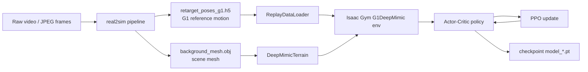
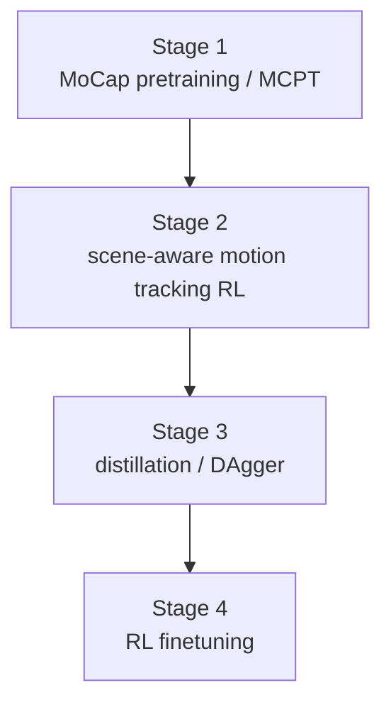
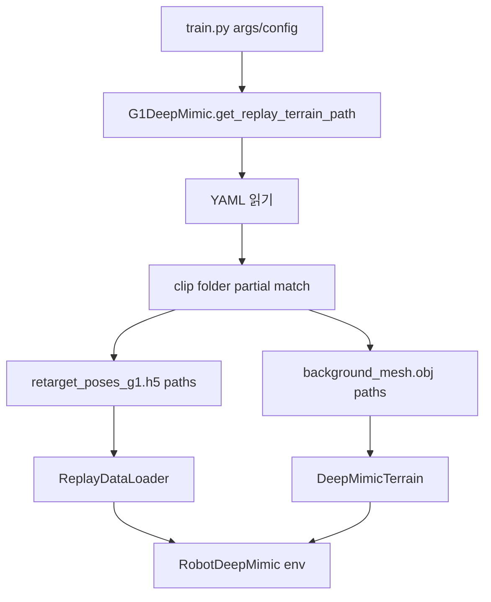
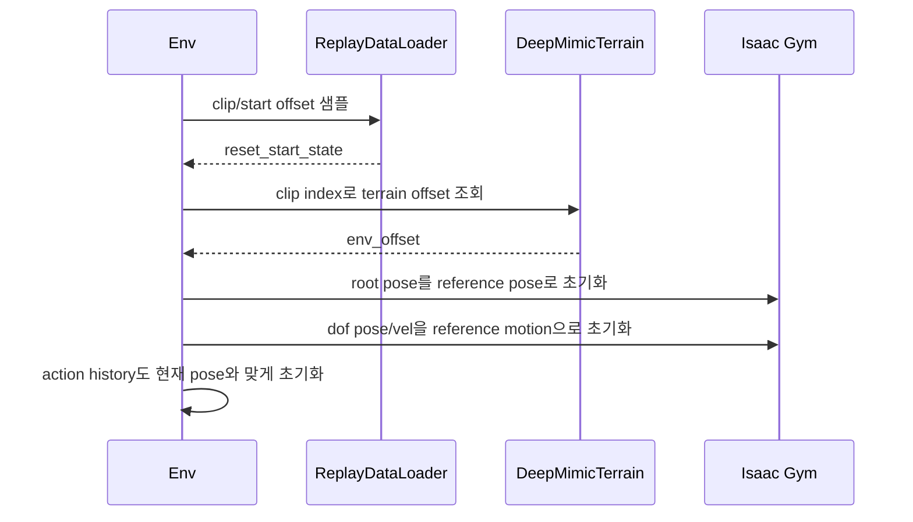
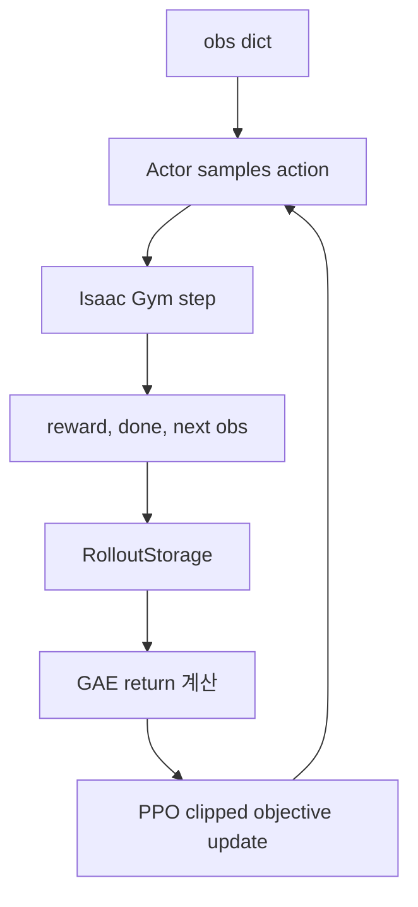
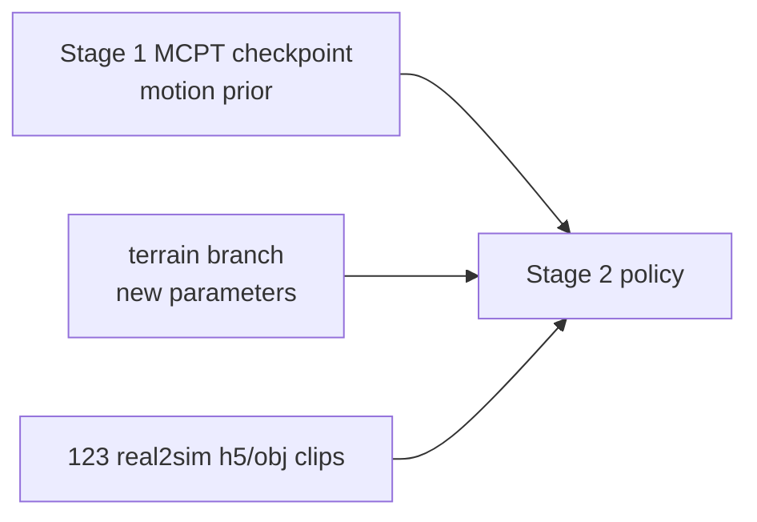

# VideoMimic Simulation 학습 구조 설명

작성일: 2026-04-10
범위: `real2sim` 결과가 이미 만들어진 뒤, `simulation` 코드가 scene/motion 데이터를 어떻게 읽고, Isaac Gym에서 어떤 네트워크와 보상으로 학습하는지 설명한다.

## 1. 한 장 요약

VideoMimic의 simulation 파트는 “비디오를 직접 보면서 학습하는 코드”가 아니다. `real2sim`이 먼저 비디오에서 **로봇이 따라야 할 G1 motion**과 **scene mesh**를 만들어두고, simulation 학습은 이 두 파일을 읽어서 강화학습을 수행한다.



핵심 파일은 보통 clip별로 아래처럼 생긴다.

```text
simulation/data/videomimic_captures/<clip_name>/
├── retarget_poses_g1.h5   # root, joints, links, contacts 등 G1 reference motion
└── background_mesh.obj    # gravity-aligned scene mesh
```

123개 VideoMimic clip 목록은 다음 YAML에 있다.

```text
simulation/videomimic_gym/resources/data_config/human_motion_list_123_motions.yaml
```

이 YAML은 각 clip에 대해 `folder_path`, `retarget_poses_g1.h5`, `background_mesh.obj`, fps override, teacher checkpoint metadata 등을 지정한다.

## 2. real2sim이 만들어주는 것

`real2sim`은 단일 카메라 RGB 비디오에서 사람과 장면을 복원한 뒤, 이를 G1 로봇이 따라갈 수 있는 형태로 바꾼다. simulation이 직접 사용하는 최종 산출물은 크게 두 개다.

| 파일 | 역할 | simulation에서의 사용 |
| --- | --- | --- |
| `retarget_poses_g1.h5` | G1 reference motion | reset pose, target joint/root/link, velocity, contact target으로 사용 |
| `background_mesh.obj` | scene mesh | Isaac Gym terrain mesh로 사용 |

`retarget_poses_g1.h5` 안에는 일반적으로 다음 정보가 들어 있다.

| H5 key / attr | 의미 |
| --- | --- |
| `root_pos` | reference root position |
| `root_quat` | reference root orientation |
| `joints` | G1 joint pose sequence |
| `link_pos` | tracked/body link positions |
| `link_quat` | tracked/body link orientations |
| `contacts/left_foot`, `contacts/right_foot` | reference foot contact labels |
| attrs: `joint_names`, `link_names`, `fps` | joint/link 이름과 원본 fps |

중요한 점:

- raw mp4/JPEG는 simulation 학습 입력이 아니다.
- raw video는 real2sim의 upstream 입력이다.
- simulation 학습은 이미 처리된 `h5 + obj`를 읽는다.

## 3. 전체 학습 stage

VideoMimic simulation README와 학습 스크립트 기준으로 파이프라인은 네 단계다.



| Stage | 스크립트 | 데이터 | 목적 |
| --- | --- | --- | --- |
| Stage 1 | `train_stage_1_mcpt.sh` | `simulation/data/unitree_lafan/*.pkl` | scene 없이 MoCap으로 reference-aware tracking policy를 먼저 학습 |
| Stage 2 | `train_stage_2_terrain_rl.sh` | `human_motion_list_123_motions.yaml`의 123개 `h5+obj` | pretrained policy를 scene-aware tracking으로 finetune |
| Stage 3 | `train_stage_3_distillation.sh` | 123개 `h5+obj` | stage-2 teacher를 더 deployable한 student policy로 distill |
| Stage 4 | `train_stage_4_rl_finetune.sh` | 123개 video data + LAFAN 일부 | distill된 terrain policy를 RL로 더 다듬음 |

우리가 자주 다룬 `g1_deepmimic_proj_heightfield`는 Stage 2에서 쓰는 scene-aware tracking task다. 공식 Stage 2는 단일 run에서 `human_motion_list_123_motions.yaml`을 넣기 때문에, 123개의 clip을 **하나의 multi-clip teacher policy**로 학습하는 구조다. 123개의 single-clip teacher를 따로 만들고 나중에 distill하는 구조가 아니다.

## 4. Stage 2 scene-aware tracking의 데이터 흐름

Stage 2 명령의 핵심은 다음과 같다.

```bash
--task=g1_deepmimic_proj_heightfield
--load_run 20250410_063030_g1_deepmimic
--resume
--env.deepmimic.human_motion_source=resources/data_config/human_motion_list_123_motions.yaml
--env.deepmimic.use_human_videos=True
--env.deepmimic.use_amass=False
--env.deepmimic.upsample_data=True
--env.deepmimic.link_pos_error_threshold=0.5
--env.deepmimic.truncate_rollout_length=500
--env.terrain.cast_mesh_to_heightfield=False
```

코드 경로는 다음 순서로 연결된다.



### 4.1 YAML에서 clip을 찾는 방식

`G1DeepMimic.get_replay_terrain_path()`는 `human_motion_source` YAML을 읽는다. 각 item에서:

- `folder_path`를 가져온다.
- `simulation/data/videomimic_captures` 안에서 해당 문자열이 포함된 folder를 찾는다.
- `human_video_data_pattern`, 기본값 `retarget_poses_g1.h5`를 붙인다.
- `human_video_terrain_pattern`, 기본값 `background_mesh.obj`를 붙인다.
- `human_video_oversample_factor`만큼 같은 clip을 replay list에 반복해서 넣을 수 있다.

이렇게 만들어진 두 리스트가 env 초기화로 들어간다.

```text
replay_data_paths = [clip1/retarget_poses_g1.h5, clip2/retarget_poses_g1.h5, ...]
terrain_paths     = [clip1/background_mesh.obj, clip2/background_mesh.obj, ...]
```

### 4.2 Motion loader: ReplayDataLoader

`ReplayDataLoader`는 `.pkl`과 `.h5`를 모두 지원하지만, VideoMimic human-video data는 현재 공개본 기준으로 주로 `.h5`다.

하는 일:

- H5에서 `root_pos`, `root_quat`, `joints`, `link_pos`, `link_quat`, `contacts`를 읽는다.
- 필요한 joint/link 이름만 현재 G1 asset 순서에 맞게 뽑는다.
- 데이터 fps가 simulator policy fps와 다르면 `upsample_data=True`일 때 50 Hz로 upsample한다.
- 위치와 joint는 linear interpolation, quaternion은 SLERP, contact는 nearest-neighbor로 upsample한다.
- 여러 clip을 하나의 큰 tensor로 concatenate하고, 각 clip의 start/end index를 보관한다.
- reset 때 clip index와 start offset을 샘플한다.

정리하면 `ReplayDataLoader`는 “현재 env들이 reference motion의 어느 clip, 어느 frame을 따라가야 하는지”를 관리하는 timeline manager다.

### 4.3 Scene loader: DeepMimicTerrain

`DeepMimicTerrain`은 clip별 `background_mesh.obj`를 읽고, Isaac Gym에 넣을 하나의 큰 terrain mesh로 이어 붙인다.

왜 이어 붙이나?

- Isaac Gym은 많은 env가 각자 다른 mesh를 쓰는 것보다, 큰 mesh 하나 위에 여러 robot을 offset시켜 올리는 방식이 효율적이다.
- 그래서 여러 scene mesh를 grid처럼 배치하고, clip index마다 `env_offsets`를 계산한다.

```text
global scene mesh
├── row 0: clip0 mesh | clip1 mesh | clip2 mesh | ...
├── row 1: clip0 mesh | clip1 mesh | clip2 mesh | ...
└── ...
```

로봇과 reference motion은 항상 “clip-local 좌표”로 생각하고, 실제 Isaac world 좌표로 넣을 때만 `env_offsets`를 더한다.

## 5. Isaac Gym simulator 셋업

Stage 2의 주요 simulator 설정은 다음과 같다.

| 항목 | 값 |
| --- | --- |
| simulator | Isaac Gym / PhysX |
| robot asset | `g1_29dof_anneal_23dof.urdf` |
| active DOF/action | 23 |
| control type | `P`, PD position target |
| action scale | `0.25` |
| sim dt | `1/200 s = 0.005 s` |
| decimation | `4` |
| policy/env step | `0.02 s = 50 Hz` |
| terrain | `background_mesh.obj`를 trimesh로 로드 |
| default parallel envs | Stage 2 script 기준 `4096` |

action의 의미는 torque가 아니다. Actor가 23차원 action을 내면:

```text
target_dof_pos = default_dof_pos + action_scale * action
```

그리고 PD controller가 이를 torque로 바꿔 Isaac Gym에 적용한다. 따라서 action `1.0`은 대략 `0.25 rad`의 joint target offset을 뜻한다.

한 policy step 안에서는 physics가 4번 돈다.

```text
policy action at 50 Hz
 └─ physics step 1 at 200 Hz
 └─ physics step 2 at 200 Hz
 └─ physics step 3 at 200 Hz
 └─ physics step 4 at 200 Hz
```

## 6. Reset과 episode 진행

학습 중 env 하나가 reset되면 다음 일이 일어난다.



일반적으로 `randomize_start_offset=True`이면 episode는 clip의 첫 프레임이 아니라 랜덤 frame에서 시작할 수 있다. 이때 success는 “그 시작점부터 남은 clip 끝까지 살아남았는가”가 된다.

## 7. Observation과 네트워크 구조

Stage 2 `g1_deepmimic_proj_heightfield`는 asymmetric actor-critic 구조다. Actor와 critic은 같은 observation dict를 받지만, 실제로 사용하는 key가 다르다.

### 7.1 Actor가 보는 것

Actor는 실제 행동을 내는 네트워크다. 입력은 비교적 압축된 tracking cue와 terrain cue다.

| 입력 key | 차원 | 의미 |
| --- | ---: | --- |
| `history_torso_real` | `75 x 5 = 375` | 최근 5 step의 proprioception: angular velocity, gravity, joint pos/vel, previous action |
| `history_torso_xy_rel` | `2 x 5 = 10` | target torso 대비 현재 torso의 xy 상대 오차 |
| `history_torso_yaw_rel` | `1 x 5 = 5` | target torso 대비 heading/yaw 오차 |
| `target_joints` | `23` | 현재 따라야 할 reference joint pose |
| `target_root_roll` | `1` | reference root roll |
| `target_root_pitch` | `1` | reference root pitch |

합계는 `415`차원이다.

### 7.2 Critic이 더 보는 것

Critic은 value를 예측하는 학습용 네트워크다. Actor가 보는 `415`차원에 더해, 더 풍부한 privileged tracking 정보를 본다.

| 추가 입력 key | 차원 | 의미 |
| --- | ---: | --- |
| `torso` | `79` | root height, base lin/ang vel, gravity, joint pos/vel, action |
| `deepmimic` | `129` | target-current root/joint/link/contact 오차에 가까운 직접 tracking 정보 |

합계는 `623`차원이다.

### 7.3 Height map branch

Scene-aware policy는 torso 주변 local height map을 본다.

| 항목 | 값 |
| --- | --- |
| sensor name | `terrain_height` |
| 기준 link | `torso_link` |
| coverage | `1.0 m x 1.0 m` |
| resolution | `0.1 m` |
| grid | `11 x 11` |
| flatten 후 | `121`차원 |

공식 Stage 2 script가 쓰는 `g1_deepmimic_proj_heightfield`에서는 이 height map이 actor/critic input에 concat되지 않는다. 대신 첫 hidden layer와 같은 512차원으로 projection되어 더해진다. 다만 같은 config 파일 안의 다른 `heightfield` policy variant는 terrain branch를 일반 head로 두어 `concat`한다.

```text
actor raw obs:  R^415
critic raw obs: R^623
terrain map:    R^(11x11) -> flatten -> R^121

actor:
  Linear(415 -> 512)
  + terrain_proj(121 -> 512) * actor_attention(512)
  -> ELU -> Linear(512 -> 256) -> ELU -> Linear(256 -> 128) -> ELU -> Linear(128 -> 23)

critic:
  Linear(623 -> 512)
  + terrain_proj(121 -> 512) * critic_attention(512)
  -> ELU -> Linear(512 -> 256) -> ELU -> Linear(256 -> 128) -> ELU -> Linear(128 -> 1)
```

여기서 `attention`은 Transformer attention이 아니다. 상태마다 바뀌는 softmax map도 아니다. 학습되는 512차원 parameter vector이며, terrain projection 결과에 elementwise로 곱해지는 gate다.

```text
z(x) = Linear(flatten(height_map))
terrain_residual(x) = z(x) * attention
hidden_0 = Linear(other_obs) + terrain_residual(x)
```

따라서:

- height map 값이 바뀌면 `z(x)`와 `terrain_residual(x)`는 바뀐다.
- `attention` vector 자체는 한 forward pass 안에서 상태에 따라 바뀌지 않는다.
- 다만 학습 중 gradient update를 통해 parameter로서 변한다.
- actor attention과 critic attention은 서로 다른 parameter다.

### 7.4 Actor 출력

Actor 출력은 23차원 Gaussian mean이다.

```text
actor output = action mean in R^23
std          = state-independent learnable vector in R^23
training     = Normal(mean, std)에서 sampling
inference    = mean action 사용
```

Critic 출력은 scalar value 하나다.

```text
critic output = V(s) in R^1
```

## 8. PPO 학습 루프

학습은 `OnPolicyRunner`와 `PPO`가 담당한다.



기본 PPO 설정은 다음과 같다.

| 항목 | 값 |
| --- | --- |
| `num_steps_per_env` | `24` |
| `num_learning_epochs` | `5` |
| `num_mini_batches` | `4` |
| `clip_param` | `0.2` |
| `gamma` | `0.99` |
| `lam` | `0.95` |
| `entropy_coef` | `0.0025` |
| `desired_kl` | `0.02` |
| `max_grad_norm` | `1.0` |
| Stage 2 learning rate | script override로 `2e-5` |
| Stage 2 schedule | `fixed` |

한 iteration은 “policy update 한 번”이지 simulator 한 step이 아니다. 예를 들어 `num_envs=4096`, `num_steps_per_env=24`이면 한 iteration마다 `4096 x 24 = 98,304`개의 env-step을 수집한 뒤 PPO update를 수행한다.

## 9. Reward 설계

Reward는 여러 항의 weighted sum이다. 각 reward name에 대해 `self._reward_<name>()` 함수가 있고, config의 `rewards.scales.<name>`이 0이 아닌 항만 사용된다.

### 9.1 주요 tracking reward

| Reward | 의미 | 형태 |
| --- | --- | --- |
| `joint_pos_tracking` | reference joint pose 추적 | `exp(-||q - q_ref||^2 * k)` |
| `joint_vel_tracking` | reference joint velocity 추적 | `exp(-||dq - dq_ref||^2 * k)` |
| `link_pos_tracking` | 13개 tracked link 위치 추적 | `exp(-sum_link ||p - p_ref||^2 * k)` |
| `link_vel_tracking` | tracked link velocity 추적 | `exp(-sum_link ||v - v_ref||^2 * k)` |
| `torso_pos_tracking` | torso 위치 추적 | `exp(-||p_torso - p_ref||^2 * k)` |
| `torso_orientation_tracking` | torso orientation 추적 | exponential orientation reward |
| `root_orientation_tracking` | root orientation 추적 | exponential orientation reward |

기본 scale 중 중요한 값:

| Reward scale | 기본값 |
| --- | ---: |
| `joint_pos_tracking` | `120.0` |
| `link_pos_tracking` | `30.0` |
| `joint_vel_tracking` | `24.0` |
| `link_vel_tracking` | `5.0` |
| `torso_pos_tracking` | `15.0` |
| `torso_orientation_tracking` | `15.0` |
| `root_orientation_tracking` | `15.0` |

### 9.2 Contact / regularization reward

| Reward | 의미 |
| --- | --- |
| `feet_contact_matching` | 현재 발 접촉 여부가 H5의 target contact와 맞는지 보상 |
| `contact_smoothness` | target과 맞지 않는 갑작스러운 contact 변화 penalty |
| `no_fly` | target상 flying이 아닌데 양발이 모두 공중이면 penalty |
| `feet_swing_height` | swing/stance에 따른 발 높이 penalty |
| `ankle_action` | ankle action 크기 penalty |
| `action_rate` | action 변화량 penalty |
| `collision` | 지정 body collision penalty |
| `dof_pos_limits` | joint limit 접근 penalty |

Stage 2 script는 일부 scale을 더 강하게 override한다.

```bash
--env.rewards.scales.termination=-2000
--env.rewards.scales.alive=200.0
--env.rewards.scales.ankle_action=-3.0
--env.rewards.scales.action_rate=-3.0
```

즉 Stage 2는 reference tracking reward에 더해:

- 살아남으면 큰 alive reward
- 실패 reset에는 큰 termination penalty
- ankle/action 변화에는 penalty

를 준다.

## 10. Termination과 success

DeepMimic 계열에서 가장 중요한 termination은 tracked link 위치 오차다.

```text
link_pos_error = ||current_tracked_link_pos - target_tracked_link_pos||

if any tracked link error > link_pos_error_threshold:
    reset
```

Stage 2 script는 보통:

```bash
--env.deepmimic.link_pos_error_threshold=0.5
```

를 사용한다. 즉 13개 tracked link 중 하나라도 reference 위치에서 0.5 m 이상 벗어나면 실패 reset된다. 단, episode 시작 직후 2 step은 예외로 둔다.

Success는 reward threshold가 아니다.

```text
success = time_out_buf == True
```

즉 episode가 실패 termination 없이 `max_episode_length`까지 도달하면 success다. `randomize_start_offset=True`일 때는 clip 중간에서 시작할 수 있으므로, success는 “전체 clip을 처음부터 끝까지 수행”이 아니라 “샘플된 시작점부터 남은 구간을 끝까지 버팀”을 뜻한다.

`Train/mean_episode_length`는 policy step 개수다. Stage 2는 50 Hz이므로:

```text
mean_episode_length = 100  ->  100 / 50 = 2.0 seconds
```

## 11. Stage 1 pretraining과 Stage 2 scene-aware tracking의 관계

Stage 1은 `g1_deepmimic` task로 LAFAN/MoCap motion을 추적하는 policy를 학습한다. 이때는 real2sim scene mesh가 핵심 입력이 아니다. 목적은 G1이 다양한 reference motion을 따라가는 기본 whole-body motion prior를 얻는 것이다.

Stage 2는 `g1_deepmimic_proj_heightfield` task로 넘어가며:

- Stage 1 checkpoint를 `--load_run 20250410_063030_g1_deepmimic --resume`으로 불러온다.
- `--train.runner.load_model_strict=False`를 사용한다.
- 기존 actor/critic에서 맞는 weight는 이어받는다.
- Stage 2에서 새로 생긴 terrain projection branch는 새로 학습된다.



따라서 pretraining은 “terrain을 미리 본 policy”를 제공하는 것이 아니라, “로봇 몸을 움직여 reference를 따라가는 기본 능력”을 제공한다. Stage 2는 그 motion prior 위에 scene/terrain correction을 얹는 과정에 가깝다.

## 12. Stage 3 distillation과 Stage 4 RL finetune

Stage 2의 teacher policy는 reference motion 정보를 꽤 많이 본다. 이는 학습에는 유리하지만 실제 배포에는 부담이 된다. Stage 3는 이 teacher를 더 단순한 student policy로 distill한다.

| Stage | 핵심 |
| --- | --- |
| Stage 2 | reference-aware scene tracking teacher |
| Stage 3 | teacher action을 따라 하는 DAgger/BC student |
| Stage 4 | BC loss를 끄고 RL reward로 student를 finetune |

Stage 3 script는 `policy_to_clone=${LOAD_RUN}` 하나를 받는다. 이 구조도 Stage 2가 123개 별도 teacher가 아니라, 하나의 multi-clip teacher policy라는 근거다.

## 13. 코드 위치 지도

| 기능 | 주요 파일 |
| --- | --- |
| 전체 simulation README | `simulation/docs/README.md` |
| VideoMimic Gym README | `simulation/videomimic_gym/README.md` |
| Stage 1 학습 스크립트 | `simulation/videomimic_gym/legged_gym/scripts/train_stage_1_mcpt.sh` |
| Stage 2 학습 스크립트 | `simulation/videomimic_gym/legged_gym/scripts/train_stage_2_terrain_rl.sh` |
| Stage 3 distillation | `simulation/videomimic_gym/legged_gym/scripts/train_stage_3_distillation.sh` |
| Stage 4 RL finetune | `simulation/videomimic_gym/legged_gym/scripts/train_stage_4_rl_finetune.sh` |
| G1 task/config/reward scale | `simulation/videomimic_gym/legged_gym/envs/g1/g1_deepmimic_config.py` |
| YAML/H5/OBJ path 구성 | `simulation/videomimic_gym/legged_gym/envs/g1/g1_deepmimic.py` |
| DeepMimic env reset/reward/termination | `simulation/videomimic_gym/legged_gym/envs/base/robot_deepmimic.py` |
| Isaac Gym base env/control loop | `simulation/videomimic_gym/legged_gym/envs/base/legged_robot.py` |
| H5/PKL motion loader | `simulation/videomimic_gym/legged_gym/tensor_utils/replay_data.py` |
| Scene mesh grid/offset | `simulation/videomimic_gym/legged_gym/utils/deepmimic_terrain.py` |
| Actor-Critic network | `simulation/videomimic_rl/rsl_rl/modules/actor_critic.py` |
| PPO runner | `simulation/videomimic_rl/rsl_rl/runners/on_policy_runner.py` |
| PPO loss/update | `simulation/videomimic_rl/rsl_rl/algorithms/ppo.py` |

## 14. 처음 보는 사람이 기억해야 할 핵심

1. Simulation 학습은 raw video가 아니라 `retarget_poses_g1.h5 + background_mesh.obj`를 읽는다.
2. Motion은 `ReplayDataLoader`, scene은 `DeepMimicTerrain`이 담당한다.
3. Isaac Gym에서는 많은 env가 병렬로 돌며, 각 env는 clip/start offset을 샘플해 reference를 따라간다.
4. Actor는 행동을 내고, critic은 더 많은 privileged tracking 정보를 보고 value를 예측한다.
5. Stage 2 actor는 `415`차원 tracking/proprioception cue를 보고, critic은 `623`차원을 본다.
6. Height map은 `11x11 -> 121 -> 512` projection으로 첫 hidden layer에 더해진다.
7. Actor 출력 23차원은 torque가 아니라 PD joint target offset이다.
8. Reward는 joint/link/torso tracking, contact matching, action regularization, alive/termination 항의 합이다.
9. 가장 중요한 failure 조건은 tracked link가 reference에서 threshold 이상 벗어나는 것이다.
10. Pretraining은 terrain 지식을 주는 것이 아니라, G1 whole-body motion tracking prior를 제공한다.
